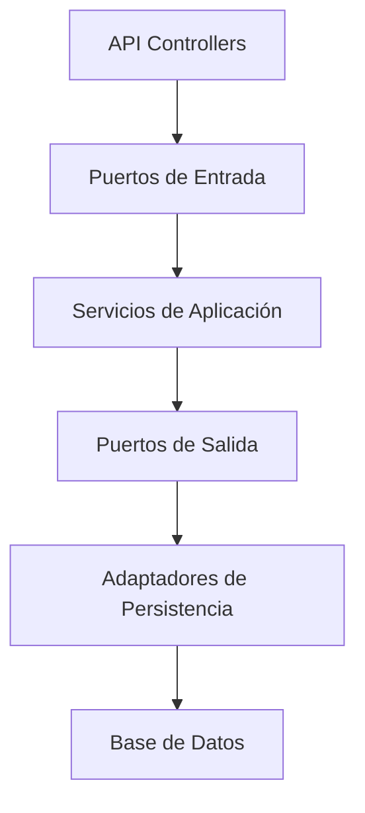
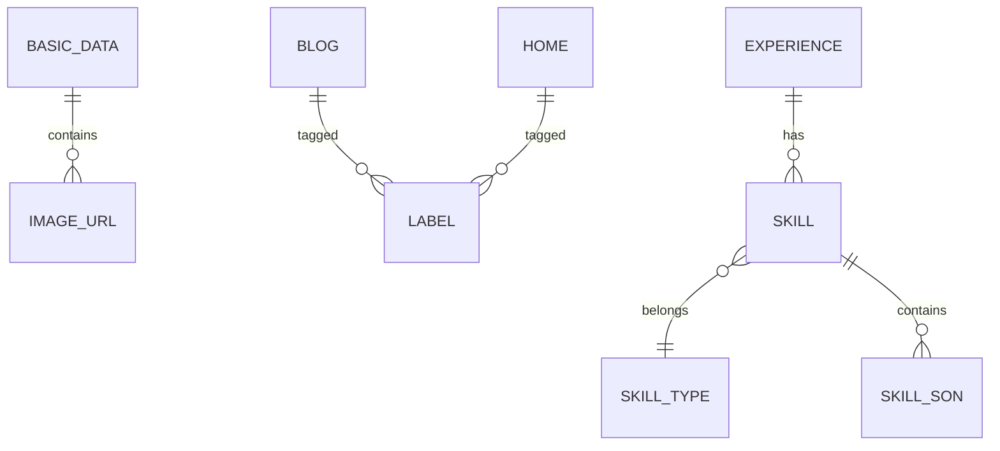

# API ms-resume – cristiansrc.com
[](https://github.com/cristiansrc/ms-resume/actions)
[](https://coveralls.io/github/cristiansrc/ms-resume)
[](https://search.maven.org/artifact/com.cristiansrc.shop/ms-resume)

Backend Java Spring Boot para la gestión y exposición del currículum, experiencia profesional, habilidades, proyectos y blog tecnológico del sitio [cristiansrc.com](https://cristiansrc.com).

Este proyecto provee una API RESTful para la administración centralizada de toda la información de la página personal, incluyendo descargas de CV en PDF, integración de imágenes, videos, etiquetas, habilidades, proyectos destacados y artículos de blog.  
La arquitectura y el diseño siguen las mejores prácticas REST, OpenAPI 3.1.0 y facilitan la generación automática de documentación y clientes.

---

## Características

- **Spring Boot 3.5.3**, Java 21+
- **Maven** como sistema de construcción
- **PostgreSQL 16.9** como base de datos relacional
- API documentada con **OpenAPI 3.1.0 (Swagger)**
- Descarga directa del CV en formato PDF
- Manejo robusto de errores y validaciones
- Relacionamiento anidado en entidades clave
- Endpoints para imágenes, videos, etiquetas, habilidades, proyectos y blog con paginación
- Internacionalización de mensajes (i18n)
- Validaciones automáticas desde OpenAPI
- Arquitectura Hexagonal (Ports & Adapters)
- Preparado para despliegue en Docker, Heroku, AWS u otros proveedores

---

## Estructura de carpetas

```plaintext
src/
  main/
    java/
      com/
        cristiansrc/
          resume/
            msresume/
              MsResumeApplication.java
              application/
                exception/
                port/
                  interactor/
                  output/
                    repository/
              infrastructure/
                controller/
                mapper/
                repository/
                  jpa/
                    entity/
              config/
    resources/
      db/
        migration/      # Scripts Flyway para migración de BD
      messages.properties   # Mensajes internacionalizados
      application.properties
  // ...otros paquetes que se agreguen en el futuro según avance el desarrollo...
```

---

## Prefijo de los endpoints
Todos los endpoints están bajo el contexto base `/v1/ms-resume`.
Por ejemplo, para datos básicos:
```
GET http://localhost:8080/v1/ms-resume/basic-data/{id}
```

---

## Generar controladores y modelos
Este proyecto incluye el plugin OpenAPI Generator configurado en él `pom.xml`. Cada vez que compiles el proyecto con Maven, los controladores y modelos se generan automáticamente a partir de `src/main/resources/openapi.yml`:

```sh
mvn clean compile
# o de forma explícita
mvn openapi-generator:generate
```

---

## Tabla de Endpoints principales
| Entidad          | Métodos         | Endpoint                                  | Descripción                                   |
|------------------|-----------------|-------------------------------------------|-----------------------------------------------|
| Basic Data       | GET, PUT        | `/v1/ms-resume/basic-data/{id}`           | Consultar o actualizar datos personales       |
| ImageUrl         | GET, POST, GET(id), DELETE | `/v1/ms-resume/image-url`, `/v1/ms-resume/image-url/{id}` | Gestión de URLs de imágenes                    |
| VideoUrl         | GET, POST, GET(id), DELETE | `/v1/ms-resume/video-url`, `/v1/ms-resume/video-url/{id}` | Gestión de URLs de videos                      |
| Label            | GET, POST, GET(id), DELETE | `/v1/ms-resume/label`, `/v1/ms-resume/label/{id}`           | Gestión de etiquetas                          |
| Home             | GET, PUT        | `/v1/ms-resume/home/{id}`                  | Gestión de la información del home            |
| Blog             | GET(pag), POST, GET(id), PUT, DELETE | `/v1/ms-resume/blog`, `/v1/ms-resume/blog/{id}` | Artículos de blog con paginación              |
| SkillType        | GET, POST, GET(id), PUT, DELETE | `/v1/ms-resume/skill-type`, `/v1/ms-resume/skill-type/{id}` | Tipos de habilidad                             |
| Skill            | GET, POST, GET(id), PUT, DELETE | `/v1/ms-resume/skill`, `/v1/ms-resume/skill/{id}` | Habilidades y especializaciones               |
| SkillSon         | GET, POST, GET(id), PUT, DELETE | `/v1/ms-resume/skill-son`, `/v1/ms-resume/skill-son/{id}` | Especializaciones de habilidades              |
| FuturedProject   | GET, POST, GET(id), PUT, DELETE | `/v1/ms-resume/futured-project`, `/v1/ms-resume/futured-project/{id}` | Proyectos destacados                          |
| Curriculum (PDF) | GET             | `/v1/ms-resume/curriculum`                | Descargar CV en formato PDF                   |

---

## Instalación y configuración

### **Requisitos previos**

- Java 21 o superior
- Maven 3.9.9+
- PostgreSQL 16.9

### **Clonar el repositorio**

```sh
git clone https://github.com/cristiansrc/ms-resume.git
cd ms-resume
```

### **Configuración del proyecto en AWS**

Edita el archivo `src/main/resources/application.properties`:

```properties
spring.application.name=ms-resume
spring.flyway.enabled=true
spring.flyway.locations=classpath:db/migration,classpath:db/callback
spring.datasource.url=${DB_URL}
spring.datasource.driver-class-name=org.postgresql.Driver
spring.datasource.username=${DB_USER}
spring.datasource.password=${DB_PASS}
spring.jpa.open-in-view=false
logging.level.root=WARN
spring.jpa.hibernate.ddl-auto=validate
spring.jpa.show-sql=false
spring.datasource.hikari.maximum-pool-size=10
spring.datasource.hikari.minimum-idle=2
```

### **Configuración del proyecto para desarrollo local**

Edita el archivo `src/main/resources/application-local.properties`:

```properties
spring.application.name=ms-resume
spring.flyway.enabled=true
spring.flyway.locations=classpath:db/migration,classpath:db/callback
spring.datasource.url=jdbc:postgresql://localhost:5432/ms-resume
spring.datasource.driver-class-name=org.postgresql.Driver
spring.datasource.username=postgres
spring.datasource.password=1234
spring.jpa.open-in-view=false
logging.level.root=info
spring.jpa.hibernate.ddl-auto=validate
spring.jpa.show-sql=true
spring.jpa.properties.hibernate.format_sql=true
```

### **Configuración del proyecto para ejcutar las pruebas unitarias*

Edita el archivo `src/main/resources/application-test.properties`:

```properties
spring.datasource.url=jdbc:h2:mem:testdb;DB_CLOSE_DELAY=-1;DB_CLOSE_ON_EXIT=FALSE
spring.datasource.driver-class-name=org.h2.Driver
spring.datasource.username=sa
spring.datasource.password=
spring.jpa.database-platform=org.hibernate.dialect.H2Dialect
spring.jpa.hibernate.ddl-auto=create-drop
spring.jpa.show-sql=true
spring.jpa.properties.hibernate.format_sql=true
spring.flyway.enabled=false
logging.level.root=ERROR
spring.main.allow-bean-definition-overriding=true
spring.datasource.hikari.maximum-pool-size=2
spring.datasource.hikari.minimum-idle=1
spring.test.database.replace=NONE
```

### **Ejecutar migraciones (Flyway)**

Asegúrate que el usuario tenga permisos de creación/modificación de tablas.

### **Construcción y ejecución**

```sh
mvn clean install
mvn spring-boot:run
```

El API estará disponible en `http://localhost:8080`.

### Docker
Este servicio incluye un Dockerfile para crear una imagen del contenedor:
```dockerfile
FROM eclipse-temurin:21-jdk
WORKDIR /app
COPY target/ms-resume-0.0.1-SNAPSHOT.jar app.jar
ENTRYPOINT ["java","-jar","/app/app.jar"]
```

Con docker-compose:
```yaml
version: '3.8'
services:
  ms-resume:
    image: cristiansrc/ms-resume:latest
    build: .
    ports:
      - "8080:8080"
    environment:
      - DB_URL=${DB_URL}
      - DB_USER=${DB_USER}
      - DB_PASS=${DB_PASS}
```

---

## CI/CD
Se incluye flujo de trabajo de GitHub Actions (`.github/workflows/maven.yml`) que ejecuta:
- Compilación y tests unitarios
- Análisis de cobertura
- Publicación de artefactos en Maven Central (on tag)

---

## Documentación y pruebas

La documentación Swagger/OpenAPI estará disponible en:

- [http://localhost:8080/swagger-ui.html](http://localhost:8080/swagger-ui.html)
- [http://localhost:8080/v3/api-docs](http://localhost:8080/v3/api-docs)

El archivo de definición OpenAPI 3.1.0 se encuentra en:  
`src/main/resources/openapi.yaml`

---

## Ejemplo de petición (descarga del curriculum PDF)

```http
GET /curriculum HTTP/1.1
Host: localhost:8080
Accept: application/pdf

# Respuesta: PDF binario, Content-Disposition: attachment; filename="curriculum-cristiansrc.pdf"
```

---

## Estándar de respuestas de error

El API define los siguientes componentes de respuesta de error disponibles en `components.responses`:

| Código HTTP | Nombre               | Descripción                                                      | Esquema        |
|-------------|----------------------|------------------------------------------------------------------|----------------|
| 400         | BadRequest           | Solicitud incorrecta - Error de validación en los datos enviados | ErrorResponse  |
| 404         | NotFound             | Recurso no encontrado                                            | ErrorResponse  |
| 500         | InternalServerError  | Error interno del servidor                                       | ErrorResponse  |

El esquema `ErrorResponse` se define en `components.schemas.ErrorResponse`:

```json
{
  "timestamp": "2025-07-16T09:00:00Z",
  "status": 400,
  "error": "Bad Request",
  "message": "Descripción del error",
  "path": "/ruta/que/causo/el/error",
  "validationErrors": [
    {
      "field": "nombreDelCampo",
      "message": "Mensaje de validación"
    }
  ]
}
```

---

## Variables de entorno
| Nombre         | Descripción                             | Ejemplo                   |
|---------------|-----------------------------------------|---------------------------|
| DB_URL        | URL de conexión a PostgreSQL            | jdbc:postgresql://...     |
| DB_USER       | Usuario de la base de datos             | postgres                  |
| DB_PASS       | Contraseña de la base de datos          | ********                  |
| AWS_S3_BUCKET | Nombre del bucket S3 para assets        | my-portfolio-bucket       |
| SPRING_PROFILES_ACTIVE | Perfil de Spring (local/test/prod) | local                     |

---

## Contribuir

1. Haz un fork del repositorio
2. Crea una rama: `git checkout -b feature/nueva-funcionalidad`
3. Realiza tus cambios y asegúrate de pasar los tests
4. Envía tu pull request

---

## Licencia

Este proyecto está bajo la licencia MIT.  
Copyright (c) 2025

---

## Contacto

Desarrollado por [Cristhiam Reina](https://cristiansrc.com)  
Email: cristiansrc@gmail.com

---

## Ejemplos de peticiones cURL
```bash
# Obtener datos básicos
curl -X GET "http://localhost:8080/v1/ms-resume/basic-data/1" -H 'Accept: application/json'

# Crear nueva etiqueta
curl -X POST "http://localhost:8080/v1/ms-resume/label" \
     -H 'Content-Type: application/json' \
     -d '{"name":"Java"}'

# Obtener habilidades
curl -X GET "http://localhost:8080/v1/ms-resume/skill" -H 'Accept: application/json'

# Obtener proyectos destacados
curl -X GET "http://localhost:8080/v1/ms-resume/featured-project" -H 'Accept: application/json'

# Obtener experiencia
curl -X GET "http://localhost:8080/v1/ms-resume/experience" -H 'Accept: application/json'
```

## Estructura del Proyecto

```
src/
├── main/
│   ├── java/
│   │   └── com/cristiansrc/resume/msresume/
│   │       ├── application/                    # Capa de aplicación
│   │       │   ├── exception/                  # Excepciones personalizadas
│   │       │   │   ├── BusinessException.java
│   │       │   │   └── TechnicalException.java
│   │       │   └── port/                       # Puertos (interfaces) para la arquitectura hexagonal
│   │       │       ├── input/                  # Puertos de entrada (casos de uso)
│   │       │       └── output/                 # Puertos de salida (repositorios)
│   │       ├── domain/                         # Capa de dominio
│   │       │   ├── entity/                     # Entidades de dominio
│   │       │   ├── repository/                 # Interfaces de repositorio
│   │       │   ├── service/                    # Servicios de dominio
│   │       │   └── valueobject/                # Objetos de valor
│   │       └── infrastructure/                 # Capa de infraestructura
│   │           ├── adapter/                    # Adaptadores para la arquitectura hexagonal
│   │           │   ├── input/                  # Adaptadores de entrada (controllers)
│   │           │   └── output/                 # Adaptadores de salida (implementación repos)
│   │           ├── config/                     # Configuraciones de Spring
│   │           ├── mapper/                     # Mappers para convertir entre DTOs y entidades
│   │           ├── persistence/                # Entidades JPA y repositorios Spring Data
│   │           └── util/                       # Clases utilitarias
│   └── resources/
│       ├── db/migration/                       # Scripts de migración Flyway
│       ├── application.properties              # Configuración principal
│       ├── application-local.properties        # Configuración para desarrollo local
│       ├── application-test.properties         # Configuración para pruebas
│       └── messages.properties                 # Mensajes i18n
└── test/                                       # Pruebas unitarias y de integración
```

### Descripción de los Paquetes Principales

#### Application
- **exception**: Manejo centralizado de excepciones del negocio y técnicas
- **port/input**: Interfaces que definen los casos de uso de la aplicación
- **port/output**: Interfaces que definen las operaciones necesarias para persistencia

#### Domain
- **entity**: Clases que representan las entidades principales del negocio
- **repository**: Interfaces que definen los contratos para acceso a datos
- **service**: Implementación de la lógica de negocio
- **valueobject**: Objetos inmutables que no tienen identidad pero describen características

#### Infrastructure
- **adapter/input**: Implementación de controladores REST
- **adapter/output**: Implementación de repositorios y servicios externos
- **config**: Configuraciones de Spring Boot, seguridad, etc
- **mapper**: Conversión entre objetos DTO y entidades de dominio
- **persistence**: Entidades JPA y repositorios Spring Data JPA
- **util**: Clases utilitarias como resolución de mensajes, validaciones, etc

---

## Diagramas

### Arquitectura Hexagonal


### Diagrama de Relaciones (ER)


---

## Seguridad

### Headers Recomendados
```properties
# Security Headers
security.headers.content-security-policy=default-src 'self'
security.headers.x-frame-options=DENY
security.headers.x-content-type-options=nosniff
security.headers.referrer-policy=strict-origin-when-cross-origin
```

### CORS
El servicio está configurado para aceptar peticiones de dominios específicos:
```java
@Configuration
public class CorsConfig {
    @Bean
    public CorsFilter corsFilter() {
        // ...existing code...
    }
}
```

### Rate Limiting
Se implementa rate limiting por IP usando bucket4j:
- 100 peticiones/minuto para endpoints públicos
- 300 peticiones/minuto para endpoints autenticados

---

## Monitoreo y Observabilidad

### Endpoints de Actuator
Disponibles en `/actuator`:
- `/health` - Estado del servicio
- `/metrics` - Métricas JVM y personalizadas
- `/prometheus` - Endpoint para Prometheus

### Métricas Disponibles
- Tiempos de respuesta por endpoint
- Tasa de errores
- Uso de memoria/CPU
- Conexiones de base de datos

### Logging
- Logging estructurado en JSON
- Correlación de trazas con `trace-id`
- Integración con ELK Stack

---

## Performance

### Configuraciones Recomendadas
```properties
# Connection Pool
spring.datasource.hikari.maximum-pool-size=20
spring.datasource.hikari.minimum-idle=5

# JPA/Hibernate
spring.jpa.properties.hibernate.jdbc.batch_size=30
spring.jpa.properties.hibernate.order_inserts=true

# Tomcat
server.tomcat.threads.max=200
server.tomcat.accept-count=100
```

### Estrategias de Caché
- Caché de segundo nivel con Hibernate
- Caché distribuido con Redis para entornos multi-instancia
- Caché de respuestas HTTP con ETags

---

## Troubleshooting

### Problemas Comunes

1. **Error de Conexión a BD**
   ```
   Caused by: org.postgresql.util.PSQLException: Connection refused
   ```
   **Solución**: Verificar credenciales y conectividad a PostgreSQL

2. **OutOfMemoryError**
   ```
   java.lang.OutOfMemoryError: Java heap space
   ```
   **Solución**: Ajustar -Xmx y monitorear uso de memoria

3. **Error en Migraciones Flyway**
   ```
   FlywayException: Migration checksum mismatch
   ```
   **Solución**: Limpiar historial de migraciones o reparar checksums

### Debugging

1. Habilitar logs de debug:
   ```properties
   logging.level.com.cristiansrc=DEBUG
   logging.level.org.hibernate.SQL=DEBUG
   ```

2. Remote Debugging:
   ```bash
   java -agentlib:jdwp=transport=dt_socket,server=y,suspend=n,address=5005
   ```

### FAQs

1. **¿Cómo actualizar la documentación OpenAPI?**
   - Modificar `openapi.yml` y recompilar

2. **¿Cómo agregar un nuevo endpoint?**
   - Definir en OpenAPI
   - Crear DTOs
   - Implementar controlador
   - Agregar pruebas

3. **¿Cómo implementar una nueva migración?**
   - Crear script SQL en `db/migration`
   - Seguir convención de nombrado Vn__descripcion.sql

---
