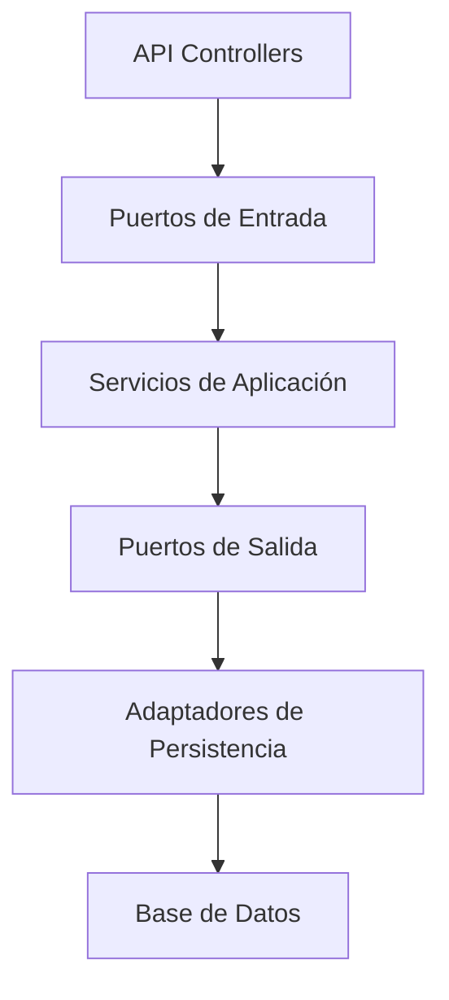
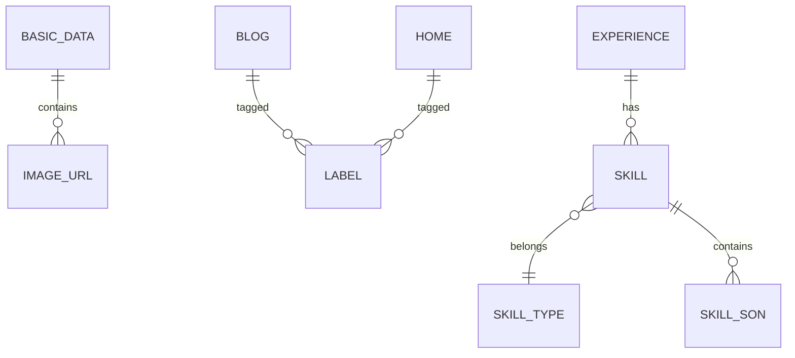

# API ms-resume – cristiansrc.com
[](https://github.com/cristiansrc/ms-resume/actions)
[](https://coveralls.io/github/cristiansrc/ms-resume)
[](https://search.maven.org/artifact/com.cristiansrc.shop/ms-resume)


Backend Java Spring Boot para la gestión y exposición del currículum, experiencia profesional, habilidades, proyectos y blog tecnológico del sitio [cristiansrc.com](https://cristiansrc.com).

Este proyecto provee una API RESTful para la administración centralizada de toda la información de la página personal, incluyendo descargas de CV en PDF, integración de imágenes, videos, etiquetas, habilidades, proyectos destacados y artículos de blog.  
La arquitectura y el diseño siguen las mejores prácticas REST, OpenAPI 3.1.0 y facilitan la generación automática de documentación y clientes.

---

## Características

- **Spring Boot 3.5.3**, Java 21+
- **Maven** como sistema de construcción
- **SQLite** como base de datos relacional (Configuración actual)
- API documentada con **OpenAPI 3.1.0 (Swagger)**
- Descarga directa del CV en formato PDF (Integración con RenderCV)
- Manejo robusto de errores y validaciones
- Relacionamiento anidado en entidades clave
- Endpoints para imágenes, videos, etiquetas, habilidades, proyectos y blog con paginación
- Internacionalización de mensajes (i18n)
- Validaciones automáticas desde OpenAPI
- Arquitectura Hexagonal (Ports & Adapters)
- Notificaciones vía Telegram Bot
- Preparado para despliegue en Docker

---

## Estructura de carpetas

> **Nota:** El proyecto está en proceso de migración hacia una Arquitectura Hexagonal. La estructura actual refleja una organización por capas tradicional de Spring Boot, que evolucionará para separar completamente el dominio de la infraestructura.

```
src/
├── main/
│   ├── java/
│   │   └── com/cristiansrc/resume/msresume/
│   │       ├── MsResumeApplication.java        # Clase principal de la aplicación
│   │       ├── application/                    # Lógica de negocio y casos de uso
│   │       │   └── usecase/
│   │       ├── config/                         # Configuración de Spring (Beans, Seguridad)
│   │       └── infrastructure/                 # Interacción con tecnologías externas
│   │           ├── controller/                 # Controladores REST
│   │           ├── mapper/                     # Mappers entre DTOs y Entidades
│   │           ├── repository/                 # Repositorios (implementación de persistencia)
│   │           │   └── jpa/
│   │           │       ├── entity/             # Entidades JPA
│   │           │       └── repository/         # Interfaces de Spring Data JPA
│   │           ├── security/                   # Configuración de seguridad y JWT
│   │           └── util/                       # Clases de utilidad
│   └── resources/
│       ├── db/migration/                       # Scripts de migración de la base de datos (Flyway)
│       ├── application.properties              # Configuración principal
│       ├── application-local.properties        # Perfil para desarrollo local
│       └── openapi.yml                         # Especificación OpenAPI
└── test/
    └── java/
        └── com/cristiansrc/resume/msresume/    # Pruebas unitarias y de integración
```

### Descripción de los Paquetes

-   **MsResumeApplication**: Punto de entrada de la aplicación Spring Boot.
-   **application**: Contiene la lógica de negocio principal y los casos de uso.
-   **config**: Clases de configuración de Spring, como la configuración de beans y seguridad.
-   **infrastructure**: Contiene las implementaciones de los componentes que interactúan con sistemas externos.
    -   **controller**: Controladores de la API REST.
    -   **mapper**: Mapeadores de objetos entre las capas de la aplicación (por ejemplo, DTO a entidad).
    -   **repository**: Implementaciones de los repositorios para el acceso a datos, utilizando JPA.
    -   **security**: Clases relacionadas con la seguridad, como la configuración de JWT.
    -   **util**: Clases de utilidad.
-   **resources**: Contiene los recursos de la aplicación, como los scripts de migración de la base de datos y los archivos de configuración.

---

## Prefijo de los endpoints
Todos los endpoints están bajo el contexto base `/v1/ms-resume`.
Por ejemplo, para datos básicos:
```
GET http://localhost:8080/v1/ms-resume/basic-data/{id}
```

---

## Generar controladores y modelos
Este proyecto incluye el plugin OpenAPI Generator configurado en él `pom.xml`. Cada vez que compiles el proyecto con Maven, los controladores y modelos se generan automáticamente a partir de `src/main/resources/openapi.yml`:

```sh
mvn clean compile
# o de forma explícita
mvn openapi-generator:generate
```

---

## Tabla de Endpoints principales

### Endpoints Públicos (no requieren autenticación)
| Entidad          | Métodos         | Endpoint                                  | Descripción                                   |
|------------------|-----------------|-------------------------------------------|-----------------------------------------------|
| Authentication   | POST            | `/login`                                  | Autenticar usuario y obtener token JWT        |
| Public           | GET             | `/public/**`                              | Endpoints públicos para consulta de datos     |
| Curriculum (PDF) | GET             | `/public/curriculum`                      | Descargar CV en formato PDF                   |

### Endpoints Privados (requieren autenticación)
| Entidad          | Métodos         | Endpoint                                  | Descripción                                   |
|------------------|-----------------|-------------------------------------------|-----------------------------------------------|
| Basic Data       | GET, PUT        | `/basic-data/{id}`                        | Consultar o actualizar datos personales       |
| ImageUrl         | GET, POST, GET(id), DELETE | `/image-url`, `/image-url/{id}`       | Gestión de URLs de imágenes                    |
| VideoUrl         | GET, POST, GET(id), DELETE | `/video-url`, `/video-url/{id}`       | Gestión de URLs de videos                      |
| Label            | GET, POST, GET(id), DELETE | `/label`, `/label/{id}`               | Gestión de etiquetas                          |
| Home             | GET, PUT        | `/home/{id}`                              | Gestión de la información del home            |
| Blog             | GET(pag), POST, GET(id), PUT, DELETE | `/blog`, `/blog/{id}`                 | Artículos de blog con paginación              |
| SkillType        | GET, POST, GET(id), PUT, DELETE | `/skill-type`, `/skill-type/{id}`     | Tipos de habilidad                             |
| Skill            | GET, POST, GET(id), PUT, DELETE | `/skill`, `/skill/{id}`               | Habilidades y especializaciones               |
| SkillSon         | GET, POST, GET(id), PUT, DELETE | `/skill-son`, `/skill-son/{id}`       | Especializaciones de habilidades              |
| FuturedProject   | GET, POST, GET(id), PUT, DELETE | `/futured-project`, `/futured-project/{id}` | Proyectos destacados                          |

---

## Instalación y configuración

### **Requisitos previos**

- Java 21 o superior
- Maven 3.9.9+

### **Clonar el repositorio**

```sh
git clone https://github.com/cristiansrc/ms-resume.git
cd ms-resume
```

### **Configuración del proyecto (Producción/Docker)**

Edita el archivo `src/main/resources/application.properties` o usa variables de entorno:

```properties
spring.application.name=ms-resume
logging.level.root=WARN
spring.main.allow-bean-definition-overriding=true

spring.flyway.enabled=true
spring.flyway.locations=classpath:db/migration/sqlite,classpath:db/callback

# Base de datos SQLite
spring.datasource.url=jdbc:sqlite:${DB_PATH:/data/ms-resume.db}
spring.datasource.driver-class-name=org.sqlite.JDBC

spring.jpa.database-platform=org.hibernate.community.dialect.SQLiteDialect
spring.jpa.open-in-view=false
spring.jpa.hibernate.ddl-auto=none
spring.jpa.show-sql=true
spring.jpa.properties.hibernate.format_sql=true

# AWS S3
aws.s3.access-key=${AWS_ACCESS_KEY}
aws.s3.secret-key=${AWS_SECRET_KEY}
aws.s3.region=${AWS_REGION}
aws.s3.bucket=${AWS_BUCKET}

# Login
auth.user=${AUTH_USER}
auth.pass=${AUTH_PASS}
jwt.secret=${JWT_SECRET}
jwt.expiration=86400000

# RenderCV
config.rendercv.url=${RENDER_CV_URL}
config.rendercv.website=https://cristiansrc.com
config.rendercv.theme=classic

# Telegram
config.telegram.bot.token=${TELEGRAM_BOT_TOKEN}
config.telegram.chat.id=${TELEGRAM_CHAT_ID}
```

### **Configuración del proyecto para desarrollo local**

Edita el archivo `src/main/resources/application-local.properties`:

```properties
spring.application.name=ms-resume
logging.level.root=info
spring.main.allow-bean-definition-overriding=true

spring.flyway.enabled=true
spring.flyway.locations=classpath:db/migration/sqlite,classpath:db/callback

spring.datasource.url=jdbc:sqlite:ms-resume.db
spring.datasource.driver-class-name=org.sqlite.JDBC

spring.jpa.database-platform=org.hibernate.community.dialect.SQLiteDialect
spring.jpa.open-in-view=false
spring.jpa.hibernate.ddl-auto=none
spring.jpa.show-sql=true
spring.jpa.properties.hibernate.format_sql=true
```

### **Configuración del proyecto para ejecutar las pruebas unitarias**

Edita el archivo `src/main/resources/application-test.properties`:

```properties
spring.datasource.url=jdbc:h2:mem:testdb;DB_CLOSE_DELAY=-1;DB_CLOSE_ON_EXIT=FALSE
spring.datasource.driver-class-name=org.h2.Driver
spring.datasource.username=sa
spring.datasource.password=
spring.jpa.database-platform=org.hibernate.dialect.H2Dialect
spring.jpa.hibernate.ddl-auto=create-drop
spring.jpa.show-sql=true
spring.jpa.properties.hibernate.format_sql=true
spring.flyway.enabled=false
logging.level.root=ERROR
spring.main.allow-bean-definition-overriding=true
spring.datasource.hikari.maximum-pool-size=2
spring.datasource.hikari.minimum-idle=1
spring.test.database.replace=NONE
```

### **Ejecutar migraciones (Flyway)**

Las migraciones se ejecutan automáticamente al iniciar la aplicación si `spring.flyway.enabled=true`.

### **Construcción y ejecución**

```sh
mvn clean install
mvn spring-boot:run
```

El API estará disponible en `http://localhost:8080`.

### Docker
Este servicio incluye un Dockerfile para crear una imagen del contenedor:
```dockerfile
# Usamos una imagen ligera de Java 21 (Eclipse Temurin es la recomendada para prod)
FROM eclipse-temurin:21-jre-alpine

# Creamos un volumen temporal (buena práctica en Spring Boot)
VOLUME /tmp

# Copiamos el JAR que GitHub nos enviará
COPY app.jar app.jar

# Configuración de inicio
ENTRYPOINT ["java","-jar","/app.jar"]
```

Con docker-compose:
```yaml
version: '3.8'
services:
  ms-resume:
    image: cristiansrc/ms-resume:latest
    build: .
    ports:
      - "8080:8080"
    volumes:
      - ./data:/data
    environment:
      - DB_PATH=/data/ms-resume.db
      - AWS_ACCESS_KEY=${AWS_ACCESS_KEY}
      - AWS_SECRET_KEY=${AWS_SECRET_KEY}
      - AWS_REGION=${AWS_REGION}
      - AWS_BUCKET=${AWS_BUCKET}
      - AUTH_USER=${AUTH_USER}
      - AUTH_PASS=${AUTH_PASS}
      - JWT_SECRET=${JWT_SECRET}
      - RENDER_CV_URL=${RENDER_CV_URL}
      - TELEGRAM_BOT_TOKEN=${TELEGRAM_BOT_TOKEN}
      - TELEGRAM_CHAT_ID=${TELEGRAM_CHAT_ID}
```

---

## CI/CD
Se incluye flujo de trabajo de GitHub Actions (`.github/workflows/maven.yml`) que ejecuta:
- Compilación y tests unitarios
- Análisis de cobertura
- Publicación de artefactos en Maven Central (on tag)

---

## Documentación y pruebas

La documentación Swagger/OpenAPI estará disponible en:

- [http://localhost:8080/swagger-ui.html](http://localhost:8080/swagger-ui.html)
- [http://localhost:8080/v3/api-docs](http://localhost:8080/v3/api-docs)

El archivo de definición OpenAPI 3.1.0 se encuentra en:  
`src/main/resources/openapi.yaml`

---

## Ejemplo de petición (descarga del curriculum PDF)

```http
GET /curriculum HTTP/1.1
Host: localhost:8080
Accept: application/pdf

# Respuesta: PDF binario, Content-Disposition: attachment; filename="curriculum-cristiansrc.pdf"
```

---

## Estándar de respuestas de error

El API define los siguientes componentes de respuesta de error disponibles en `components.responses`:

| Código HTTP | Nombre               | Descripción                                                      | Esquema        |
|-------------|----------------------|------------------------------------------------------------------|----------------|
| 400         | BadRequest           | Solicitud incorrecta - Error de validación en los datos enviados | ErrorResponse  |
| 404         | NotFound             | Recurso no encontrado                                            | ErrorResponse  |
| 500         | InternalServerError  | Error interno del servidor                                       | ErrorResponse  |

El esquema `ErrorResponse` se define en `components.schemas.ErrorResponse`:

```json
{
  "timestamp": "2025-07-16T09:00:00Z",
  "status": 400,
  "error": "Bad Request",
  "message": "Descripción del error",
  "path": "/ruta/que/causo/el/error",
  "validationErrors": [
    {
      "field": "nombreDelCampo",
      "message": "Mensaje de validación"
    }
  ]
}
```

---

## Variables de entorno
| Nombre         | Descripción                             | Ejemplo                   |
|---------------|-----------------------------------------|---------------------------|
| DB_PATH       | Ruta al archivo de base de datos SQLite | /data/ms-resume.db        |
| AWS_ACCESS_KEY| Access Key de AWS                       | AKIA...                   |
| AWS_SECRET_KEY| Secret Key de AWS                       | wJalr...                  |
| AWS_REGION    | Región de AWS                           | us-east-2                 |
| AWS_BUCKET    | Nombre del bucket S3                    | cristiansrc.shop          |
| AUTH_USER     | Usuario para autenticación              | admin                     |
| AUTH_PASS     | Contraseña para autenticación           | secret                    |
| JWT_SECRET    | Secreto para firmar tokens JWT          | base64_secret...          |
| RENDER_CV_URL | URL del servicio RenderCV               | http://rendercv-service...|
| TELEGRAM_BOT_TOKEN | Token del bot de Telegram          | 123456:ABC-DEF...         |
| TELEGRAM_CHAT_ID | ID del chat de Telegram              | 123456789                 |
| SPRING_PROFILES_ACTIVE | Perfil de Spring (local/test/prod) | local                     |

---

## Contribuir

1. Haz un fork del repositorio
2. Crea una rama: `git checkout -b feature/nueva-funcionalidad`
3. Realiza tus cambios y asegúrate de pasar los tests
4. Envía tu pull request

---

## Licencia

Este proyecto está bajo la licencia MIT.  
Copyright (c) 2025

---

## Contacto

Desarrollado por [Cristhiam Reina](https://cristiansrc.com)  
Email: cristiansrc@gmail.com

---

## Ejemplos de peticiones cURL
```bash
# Obtener datos básicos
curl -X GET "http://localhost:8080/v1/ms-resume/basic-data/1" -H 'Accept: application/json'

# Crear nueva etiqueta
curl -X POST "http://localhost:8080/v1/ms-resume/label" \
     -H 'Content-Type: application/json' \
     -d '{"name":"Java"}'

# Obtener habilidades
curl -X GET "http://localhost:8080/v1/ms-resume/skill" -H 'Accept: application/json'

# Obtener proyectos destacados
curl -X GET "http://localhost:8080/v1/ms-resume/featured-project" -H 'Accept: application/json'

# Obtener experiencia
curl -X GET "http://localhost:8080/v1/ms-resume/experience" -H 'Accept: application/json'
```

---

## Diagramas

### Arquitectura Hexagonal


### Diagrama de Relaciones (ER)


---

## Seguridad

### Headers Recomendados
```properties
# Security Headers
security.headers.content-security-policy=default-src 'self'
security.headers.x-frame-options=DENY
security.headers.x-content-type-options=nosniff
security.headers.referrer-policy=strict-origin-when-cross-origin
```

### CORS
El servicio está configurado para aceptar peticiones de dominios específicos:
```java
@Configuration
public class CorsConfig {
    @Bean
    public CorsFilter corsFilter() {
        // ...existing code...
    }
}
```

### Rate Limiting
Se implementa rate limiting por IP usando bucket4j:
- 100 peticiones/minuto para endpoints públicos
- 300 peticiones/minuto para endpoints autenticados

---

## Monitoreo y Observabilidad

### Endpoints de Actuator
Disponibles en `/actuator`:
- `/health` - Estado del servicio
- `/metrics` - Métricas JVM y personalizadas
- `/prometheus` - Endpoint para Prometheus

### Métricas Disponibles
- Tiempos de respuesta por endpoint
- Tasa de errores
- Uso de memoria/CPU
- Conexiones de base de datos

### Logging
- Logging estructurado en JSON
- Correlación de trazas con `trace-id`
- Integración con ELK Stack

---

## Performance

### Configuraciones Recomendadas
```properties
# Connection Pool
spring.datasource.hikari.maximum-pool-size=20
spring.datasource.hikari.minimum-idle=5

# JPA/Hibernate
spring.jpa.properties.hibernate.jdbc.batch_size=30
spring.jpa.properties.hibernate.order_inserts=true

# Tomcat
server.tomcat.threads.max=200
server.tomcat.accept-count=100
```

### Estrategias de Caché
- Caché de segundo nivel con Hibernate
- Caché distribuido con Redis para entornos multi-instancia
- Caché de respuestas HTTP con ETags

---

## Troubleshooting

### Problemas Comunes

1. **Error de Conexión a BD**
   ```
   Caused by: org.sqlite.SQLiteException: [SQLITE_CANTOPEN] Unable to open the database file
   ```
   **Solución**: Verificar permisos de escritura en el directorio de la base de datos o ruta correcta.

2. **OutOfMemoryError**
   ```
   java.lang.OutOfMemoryError: Java heap space
   ```
   **Solución**: Ajustar -Xmx y monitorear uso de memoria

3. **Error en Migraciones Flyway**
   ```
   FlywayException: Migration checksum mismatch
   ```
   **Solución**: Limpiar historial de migraciones o reparar checksums

### Debugging

1. Habilitar logs de debug:
   ```properties
   logging.level.com.cristiansrc=DEBUG
   logging.level.org.hibernate.SQL=DEBUG
   ```

2. Remote Debugging:
   ```bash
   java -agentlib:jdwp=transport=dt_socket,server=y,suspend=n,address=5005
   ```

### FAQs

1. **¿Cómo actualizar la documentación OpenAPI?**
   - Modificar `openapi.yml` y recompilar

2. **¿Cómo agregar un nuevo endpoint?**
   - Definir en OpenAPI
   - Crear DTOs
   - Implementar controlador
   - Agregar pruebas

3. **¿Cómo implementar una nueva migración?**
   - Crear script SQL en `db/migration`
   - Seguir convención de nombrado Vn__descripcion.sql

---
